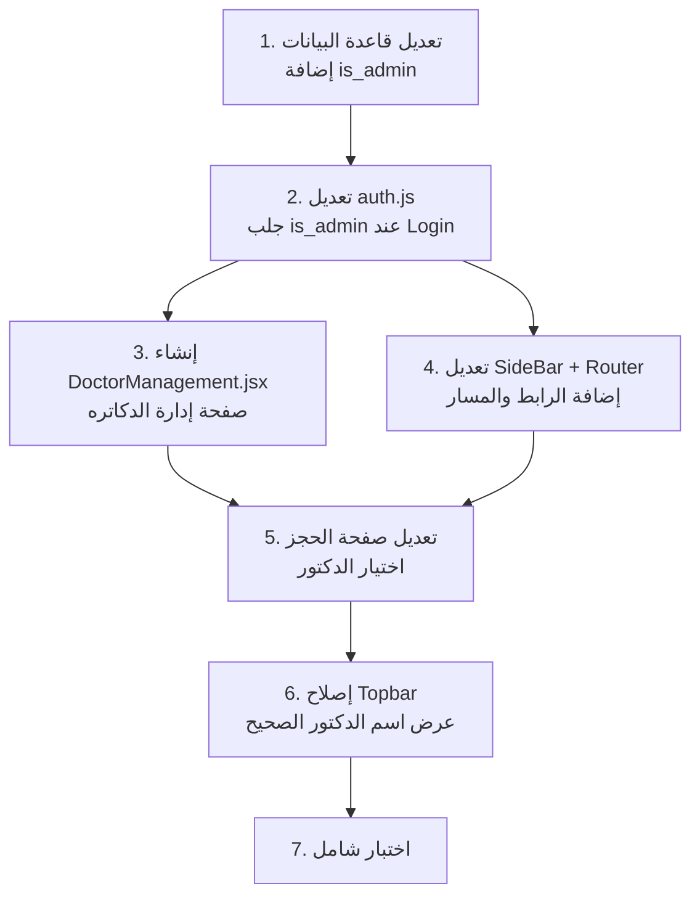

# 🏥 خطة إدارة الدكاتره - Smart Clinic

## 📋 ملخص المشكلة

النظام الحالي مصمم للعمل مع **دكتور واحد فقط**، وده بيسبب مشاكل كتير لو عايز تضيف دكاتره تانيين. الخطة دي بتغطي كل المشاكل الموجودة والحل الأنسب ليها.

---

## 🔍 تحليل المشاكل الحالية

### المشكلة 1: `doctor_id` ثابت في صفحة الحجز العام

> [!CAUTION]
> **ملف**: [booking.js](file:///d:/health_project-main/health_project-main/src/supaBase/booking.js#L35)
> 
> السطر `doctor_id: 1` ثابت — أي حجز من الموقع هيروح تلقائياً للدكتور رقم 1 بس.

```javascript
// الكود الحالي (المشكلة) - booking.js:35
const { error } = await supabase
  .from('appointments')
  .insert([{
    date: patientData.bookingDate,
    visitType: patientData.visitType,
    status: 'محجوز',
    doctor_id: 1, // ← ثابت! أي دكتور جديد مش هيوصله حجوزات
    patient_id: existingPhone?.id || newPatient?.id,
    time: now.toLocaleTimeString(),
  }])
```

---

### المشكلة 2: عدم وجود مفهوم "دكتور أدمن"

> [!WARNING]
> **ملف**: [DoctorDashbord.jsx](file:///d:/health_project-main/health_project-main/src/pages/doctorDashbord/pages/DoctorDashbord.jsx#L22)
>
> النظام بيتحقق بس إن الـ `role === 'doctor'`، لكن مفيش تفريق بين دكتور عادي ودكتور أدمن.

```javascript
// الكود الحالي
const { CUrole } = useAuthStore();
if (CUrole() != 'doctor') location.replace('/notFound');
// ← مفيش check على is_admin أو الصلاحيات
```

---

### المشكلة 3: عدم وجود صفحة لإدارة الدكاتره

حالياً مفيش أي صفحة في الداشبورد تسمح للأدمن يضيف/يعدل/يحذف دكاتره. الطريقة الوحيدة هي الدخول على Supabase Dashboard يدوياً.

---

### المشكلة 4: Topbar بيعرض أول دكتور دايماً

> [!NOTE]
> **ملف**: [Topbar.jsx](file:///d:/health_project-main/health_project-main/src/pages/doctorDashbord/components/Topbar.jsx#L66)

```javascript
// الكود الحالي
<span className="user-name">
  {doctors.length > 0 ? `${doctors[0].name}` : 'د/مجهول'}
  // ← بيجيب أول دكتور من القايمة، مش الدكتور المسجل دخوله
</span>
```

---

## ✅ خطة الحل التفصيلية

### المرحلة 1: تعريف مفهوم "الدكتور الأدمن" في قاعدة البيانات

**الحل:** إضافة عمود `is_admin` في جدول `doctors` في Supabase.

```sql
-- إضافة عمود is_admin لجدول doctors
ALTER TABLE doctors ADD COLUMN is_admin BOOLEAN DEFAULT false;

-- تحديد الدكتور الحالي كأدمن
UPDATE doctors SET is_admin = true WHERE id = 1;
```

**تحديث في**: [auth.js](file:///d:/health_project-main/health_project-main/src/store/auth.js)

```diff
 // عند تسجيل الدخول, جلب is_admin مع doctor_id
 if (metadata?.role === 'doctor' && data.user?.id) {
   const { data: doctorData } = await supabase
     .from('doctors')
-    .select('id')
+    .select('id, is_admin')
     .eq('user_id', data.user.id)
     .single();

   if (doctorData) {
     doctorId = doctorData.id;
+    isAdmin = doctorData.is_admin || false;
   }
 }

-set({ current_user: { ...metadata, doctor_id: doctorId, auth_uid: data.user?.id } });
+set({ current_user: { ...metadata, doctor_id: doctorId, is_admin: isAdmin, auth_uid: data.user?.id } });
```

```diff
 // إضافة getter جديد
+CUisAdmin: () => get().current_user?.is_admin || false,
```

---

### المرحلة 2: إنشاء صفحة إدارة الدكاتره (Admin Only)

#### الملفات الجديدة المطلوبة:

| الملف | الوصف |
|---|---|
| `src/pages/doctorDashbord/pages/DoctorManagement.jsx` | الصفحة الرئيسية لإدارة الدكاتره |
| `src/pages/doctorDashbord/pages/DoctorManagement.css` | التصميم الخاص بالصفحة |

#### المميزات المطلوبة في الصفحة:

1. **جدول الدكاتره**: عرض جميع الدكاتره الموجودين بالمركز
2. **إضافة دكتور جديد**: فورم لإنشاء حساب دكتور جديد يشمل:
   - الاسم الكامل
   - البريد الإلكتروني
   - كلمة المرور
   - التخصص
   - رقم الهاتف
   - الرسوم (fees)
3. **تعديل بيانات دكتور**: تعديل البيانات الأساسية
4. **تفعيل/إلغاء تفعيل دكتور**: بدل الحذف الكامل

#### آلية إضافة دكتور جديد (الخطوات البرمجية):

```javascript
const addNewDoctor = async (doctorData) => {
  // الخطوة 1: إنشاء حساب Auth في Supabase
  const { data: authData, error: authError } = await supabase.auth.signUp({
    email: doctorData.email,
    password: doctorData.password,
    options: {
      data: {
        full_name: doctorData.name,
        phone: doctorData.phone,
        role: 'doctor',
      },
    },
  });

  if (authError) throw authError;

  // الخطوة 2: إضافة سجل في جدول doctors
  const { data: doctor, error: doctorError } = await supabase
    .from('doctors')
    .insert({
      name: doctorData.name,
      specialization: doctorData.specialization,
      phone: doctorData.phone,
      fees: doctorData.fees,
      user_id: authData.user.id,
      is_admin: false,
    })
    .select()
    .single();

  if (doctorError) throw doctorError;

  return doctor;
};
```

> [!IMPORTANT]
> **مشكلة مهمة:** استخدام `supabase.auth.signUp()` من الـ frontend بالـ anon key **هيعمل sign out** للمستخدم الحالي (الأدمن) وهيسجل دخول الحساب الجديد!
>
> **الحل الأنسب:** استخدام **Supabase Edge Function** أو **Service Role Key** من backend لإنشاء المستخدمين. لكن بما إن المشروع frontend فقط، هنستخدم حل بديل:
> 1. إنشاء الحساب عبر `signUp`
> 2. إعادة تسجيل دخول الأدمن تلقائياً بعد الإنشاء
> 
> **أو الأفضل**: استخدام Supabase `admin.createUser()` عبر Edge Function (أنظف وأأمن).

#### الحل العملي (بدون Backend):

```javascript
const addNewDoctor = async (doctorData) => {
  // حفظ session الأدمن الحالي
  const { data: { session: adminSession } } = await supabase.auth.getSession();

  // 1. إنشاء حساب الدكتور الجديد
  const { data: authData, error: authError } = await supabase.auth.signUp({
    email: doctorData.email,
    password: doctorData.password,
    options: {
      data: {
        full_name: doctorData.name,
        phone: doctorData.phone,
        role: 'doctor',
      },
    },
  });

  if (authError) throw authError;

  // 2. إعادة تسجيل دخول الأدمن فوراً
  await supabase.auth.setSession({
    access_token: adminSession.access_token,
    refresh_token: adminSession.refresh_token,
  });

  // 3. إضافة سجل في جدول doctors
  const { data: doctor, error: doctorError } = await supabase
    .from('doctors')
    .insert({
      name: doctorData.name,
      specialization: doctorData.specialization,
      phone: doctorData.phone,
      fees: doctorData.fees,
      user_id: authData.user.id,
      is_admin: false,
    })
    .select()
    .single();

  if (doctorError) throw doctorError;
  return doctor;
};
```

---

### المرحلة 3: تعديل الـ Sidebar لإظهار رابط إدارة الدكاتره للأدمن فقط

**ملف**: [SideBar.jsx](file:///d:/health_project-main/health_project-main/src/pages/doctorDashbord/components/SideBar.jsx)

```diff
+import AdminPanelSettingsIcon from "@mui/icons-material/AdminPanelSettings";
+import useAuthStore from "../../../store/auth";

 function SideBar({ isOpen, toggleSidebar }) {
+    const { CUisAdmin } = useAuthStore();
     return (
         ...
         <ul className="sidebar-list">
             ... (الروابط الحالية) ...
+            {CUisAdmin() && (
+                <li className="sidebar-item">
+                    <NavLink to="/DoctorDashboard/doctor-management" className="sidebar-link">
+                        <AdminPanelSettingsIcon /> إدارة الدكاتره
+                    </NavLink>
+                </li>
+            )}
         </ul>
```

---

### المرحلة 4: تعديل الـ Router لإضافة المسار الجديد

**ملف**: [DoctorDashbord.jsx](file:///d:/health_project-main/health_project-main/src/pages/doctorDashbord/pages/DoctorDashbord.jsx)

```diff
+import DoctorManagement from './DoctorManagement';

 <Routes>
   ...existing routes...
+  <Route path="doctor-management" element={<DoctorManagement />} />
 </Routes>
```

---

### المرحلة 5: تعديل صفحة الحجز العامة لاختيار الدكتور

#### 5.1 تعديل الـ Schema

**ملف**: [schema.js](file:///d:/health_project-main/health_project-main/src/pages/bookingPage/schema.js)

```diff
 export const Schema = Yup.object({
   ...existing fields...
+  doctor_id: Yup.number().required('يجب اختيار الطبيب'),
 });

 export const formData = {
   ...existing fields...
+  doctor_id: '',
 };
```

#### 5.2 إنشاء مكون DoctorSelect

**ملف جديد**: `src/pages/bookingPage/component/DoctorSelect.jsx`

مكون dropdown يعرض قائمة الدكاتره المتاحين، مع اسم الدكتور وتخصصه.

#### 5.3 تعديل booking.js

**ملف**: [booking.js](file:///d:/health_project-main/health_project-main/src/supaBase/booking.js)

```diff
 const { error } = await supabase
   .from('appointments')
   .insert([{
     date: patientData.bookingDate,
     visitType: patientData.visitType,
     status: 'محجوز',
-    doctor_id: 1,
+    doctor_id: patientData.doctor_id,
     patient_id: existingPhone?.id || newPatient?.id,
     time: now.toLocaleTimeString(),
   }])
```

#### 5.4 تعديل Body.jsx

**ملف**: [Body.jsx](file:///d:/health_project-main/health_project-main/src/pages/bookingPage/component/Body.jsx)

```diff
+import { DoctorSelect } from "./DoctorSelect";

 <div className="grid grid-cols-1 md:grid-cols-2 gap-6">
   <NameInput />
   <AddressInput />
   <AgeInput />
   <PhoneInput />
   <BookingDataInput />
   <VisitTypeInput />
+  <DoctorSelect />
 </div>
```

---

### المرحلة 6: إصلاح Topbar لعرض اسم الدكتور الصحيح

**ملف**: [Topbar.jsx](file:///d:/health_project-main/health_project-main/src/pages/doctorDashbord/components/Topbar.jsx)

```diff
+const { CUdoctorId } = useAuthStore();
+const currentDoctorId = CUdoctorId();
+const currentDoctor = doctors.find(d => d.id === currentDoctorId);

 <span className="user-name">
-  {doctors.length > 0 ? `${doctors[0].name}` : 'د/مجهول'}
+  {currentDoctor ? `${currentDoctor.name}` : 'د/مجهول'}
 </span>
```

---

## 📁 ملخص الملفات المتأثرة

### ملفات تحتاج تعديل (موجودة):

| # | الملف | نوع التعديل |
|---|---|---|
| 1 | [auth.js](file:///d:/health_project-main/health_project-main/src/store/auth.js) | إضافة `is_admin` في login + getter جديد |
| 2 | [booking.js](file:///d:/health_project-main/health_project-main/src/supaBase/booking.js) | تغيير `doctor_id: 1` لـ dynamic |
| 3 | [schema.js](file:///d:/health_project-main/health_project-main/src/pages/bookingPage/schema.js) | إضافة حقل `doctor_id` |
| 4 | [Body.jsx](file:///d:/health_project-main/health_project-main/src/pages/bookingPage/component/Body.jsx) | إضافة `<DoctorSelect />` |
| 5 | [SideBar.jsx](file:///d:/health_project-main/health_project-main/src/pages/doctorDashbord/components/SideBar.jsx) | إضافة رابط إدارة الدكاتره |
| 6 | [DoctorDashbord.jsx](file:///d:/health_project-main/health_project-main/src/pages/doctorDashbord/pages/DoctorDashbord.jsx) | إضافة Route جديد |
| 7 | [Topbar.jsx](file:///d:/health_project-main/health_project-main/src/pages/doctorDashbord/components/Topbar.jsx) | عرض اسم الدكتور الصحيح |

### ملفات جديدة مطلوبة:

| # | الملف | الوصف |
|---|---|---|
| 1 | `src/pages/doctorDashbord/pages/DoctorManagement.jsx` | صفحة إدارة الدكاتره الكاملة |
| 2 | `src/pages/doctorDashbord/pages/DoctorManagement.css` | تصميم صفحة إدارة الدكاتره |
| 3 | `src/pages/bookingPage/component/DoctorSelect.jsx` | مكون اختيار الدكتور في الحجز |

### تعديلات قاعدة البيانات (Supabase):

| # | التعديل |
|---|---|
| 1 | إضافة عمود `is_admin BOOLEAN DEFAULT false` لجدول `doctors` |
| 2 | تحديث الدكتور الحالي: `UPDATE doctors SET is_admin = true WHERE id = 1` |

---

## 🔄 ترتيب التنفيذ المقترح



---

## ⚠️ نقاط تحتاج قرار منك

> [!IMPORTANT]
> ### 1. طريقة إنشاء حساب الدكتور الجديد
> - **الخيار أ (أبسط):** استخدام `supabase.auth.signUp()` من الـ frontend مع إعادة تسجيل دخول الأدمن تلقائياً
> - **الخيار ب (أأمن):** استخدام Supabase Edge Function مع Service Role Key
> 
> **توصيتي:** الخيار أ للبساطة (frontend only project)

> [!IMPORTANT]
> ### 2. هل تريد صفحة الحجز العامة تعرض كل الدكاتره ولا دكاتره تخصص معين؟
> - عرض كل الدكاتره المتاحين
> - عرض بناءً على التخصص (يحتاج إضافة حقل `specialization` لو مش موجود)

> [!IMPORTANT]
> ### 3. هل محتاج الأدمن يقدر يحذف دكتور نهائياً ولا بس يعطله (disable)؟
> - الحذف النهائي يحذف كل البيانات المرتبطة
> - التعطيل أأمن (إضافة عمود `is_active` لجدول doctors)

---

## 🎨 تصميم صفحة إدارة الدكاتره المقترح

الصفحة هتكون متسقة مع باقي الداشبورد وتشمل:

1. **Header**: عنوان "إدارة الأطباء" + زرار "إضافة طبيب جديد"
2. **جدول/كروت**: عرض كل الدكاتره مع:
   - صورة + اسم الدكتور
   - التخصص
   - رقم الهاتف
   - رسوم الكشف
   - حالة الحساب (نشط/معطل)
   - أزرار (تعديل - تعطيل)
3. **Modal لإضافة/تعديل**: فورم بكل بيانات الدكتور الجديد
4. **إحصائيات سريعة**: عدد الدكاتره الكلي + النشطين

---

**هل الخطة دي مناسبة ليك؟ وعايزني أبدأ التنفيذ بأي مرحلة؟**
