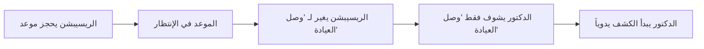
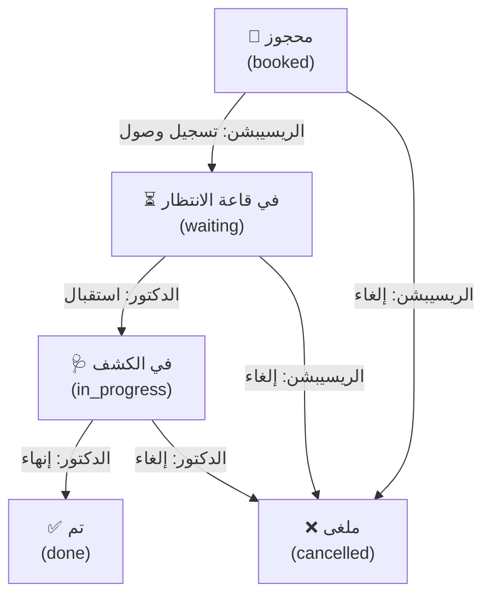

# 📋 وثيقة إعادة هيكلة تدفق المريض (Reception → Doctor)

## 📌 المشكلة الحالية

### الوضع الحالي في النظام:



### المشاكل:

| # | المشكلة | التأثير |
|---|---------|---------|
| 1 | **مفيش تفريق بين "حجز جديد" و "دخول مريض قديم"** | كل مرة الريسيبشن بيسجل بيانات الموعد زي أول مرة |
| 2 | **"وصل العيادة" مش كافية** | مفيش فرق بين "وصل" و "دخل عند الدكتور فعلاً" |
| 3 | **الدكتور مش عارف مين اللي دوره** | بيشوف القائمة بس مش واضح ترتيب الأدوار |
| 4 | **السجل المرضي مش مرتبط تلقائياً** | الدكتور لازم يبحث يدوياً عن المريض في السجلات |
| 5 | **مفيش ربط بين الموعد والزيارة** | Visit بيتسجل بعد الكشف بس مش مرتبط بالتدفق |

---

## 🏥 البيزنس موديل الصحيح

### التدفق المثالي لعيادة حقيقية:

```
┌──────────────────────────────────────────────────────────────────────┐
│                         مسار المريض الجديد                           │
├──────────────────────────────────────────────────────────────────────┤
│                                                                      │
│  1. مريض يتصل أو يجي العيادة                                        │
│     ↓                                                                │
│  2. الريسيبشن يبحث بالاسم أو الموبايل                                │
│     ↓                                                                │
│  3. ❌ مريض غير موجود → "حجز جديد" (ينشئ Patient + Appointment)     │
│     ✅ مريض موجود → "تسجيل دخول" (ينشئ Appointment فقط)             │
│     ↓                                                                │
│  4. الموعد حالته: "محجوز" 📅                                         │
│     ↓                                                                │
│  5. المريض يوصل العيادة → الريسيبشن يضغط "تسجيل وصول"              │
│     ↓                                                                │
│  6. الموعد حالته: "في قاعة الانتظار" ⏳                              │
│     (المريض يظهر في شاشة الدكتور في قائمة الانتظار)                 │
│     ↓                                                                │
│  7. الدكتور يضغط "استقبال المريض" (أول واحد في الدور)               │
│     ↓                                                                │
│  8. الموعد حالته: "في الكشف" 🩺                                      │
│     (السجل المرضي يفتح تلقائياً)                                     │
│     ↓                                                                │
│  9. الدكتور يكتب الكشف + الروشتة + التحاليل                        │
│     ↓                                                                │
│  10. الدكتور يضغط "إنهاء الكشف"                                     │
│      ↓                                                                │
│  11. الموعد حالته: "تم" ✅                                            │
│      (Visit يتسجل + المريض يخرج من القائمة)                          │
│                                                                      │
└──────────────────────────────────────────────────────────────────────┘
```

---

## 🔄 مراحل حالة الموعد (Status Flow)

### الحالات الخمس:



| الحالة | المسؤول | الوصف | اللون |
|--------|---------|-------|-------|
| 📅 محجوز | الريسيبشن | المريض حجز بس لسه ما وصلش | أزرق فاتح |
| ⏳ في قاعة الانتظار | الريسيبشن | المريض وصل وبيستنى دوره | برتقالي |
| 🩺 في الكشف | الدكتور | المريض عند الدكتور دلوقتي | بنفسجي |
| ✅ تم | الدكتور | الكشف خلص | أخضر |
| ❌ ملغى | أي حد | الموعد اتلغى | أحمر |

> [!IMPORTANT]
> ### الفرق عن الوضع الحالي
> حالياً فيه **3 حالات فقط** (في الإنتظار / وصل العيادة / ملغى).
> المقترح يضيف **محجوز** (قبل الوصول) و**في الكشف** (عند الدكتور) عشان نتتبع المريض بدقة.

---

## 👤 سيناريو حجز مريض قديم vs جديد

### السيناريو 1: مريض جديد (أول مرة)

```
الريسيبشن يكتب الاسم → مفيش نتائج بحث → يملا البيانات →
ينشئ Patient جديد + Appointment → الحالة = "محجوز"
```

### السيناريو 2: مريض قديم (زيارة متابعة)

```
الريسيبشن يكتب الاسم أو الموبايل → يختار المريض من القائمة →
البيانات تتملا تلقائياً (اسم، موبايل، عنوان، عمر) →
يختار الدكتور + التاريخ + نوع الزيارة → ينشئ Appointment فقط →
الحالة = "محجوز"
```

> [!TIP]
> ### ده اللي بيحصل دلوقتي فعلاً!
> النظام الحالي في `AppointmentModal.jsx` **بيبحث بالاسم** ولو لقى المريض بيستخدم الـ `patient_id` بتاعه. ده جزء كبير من الحل موجود بالفعل.
> اللي ناقص هو **التفريق في الحالات** وربط **شاشة الدكتور بالسجل المرضي تلقائياً**.

---

## 🖥️ التغييرات المطلوبة

### 1. تحديث حالات الموعد (Status Values)

**قبل:**
```
'في الإنتظار' | 'وصل العيادة' | 'ملغى' | 'تم'
```

**بعد:**
```
'محجوز' | 'في قاعة الانتظار' | 'في الكشف' | 'تم' | 'ملغى'
```

> [!WARNING]
> ### ⚠️ تغيير قيم الحالات (Breaking Change)
> لازم نحدّث كل الأماكن اللي بتتعامل مع الحالات القديمة:
> - `appointmentStore.js`
> - `doctorDashboardStore.js` — الدكتور حالياً بيفلتر على `'وصل العيادة'` هنغيرها لـ `'في قاعة الانتظار'`
> - `ReceptionAppointments.jsx` + `AppointmentModal.jsx`
> - `AppointmentViewModal.jsx`
> - كل Appointment components في الدكتور والتمريض
> - بيانات قاعدة البيانات الحالية (المواعيد اللي حالتها القديمة)

---

### 2. شاشة الريسيبشن — تغييرات الأزرار

#### الشاشة الحالية:
- "وصل العيادة" / "في الإنتظار" / "إلغاء"

#### الشاشة المقترحة:
| الزر | يظهر لما الحالة = | بيغير الحالة لـ |
|------|------------------|----------------|
| 📥 تسجيل وصول | محجوز | في قاعة الانتظار |
| ❌ إلغاء | محجوز أو في قاعة الانتظار | ملغى |
| 🔙 إرجاع لمحجوز | في قاعة الانتظار | محجوز |

---

### 3. شاشة الدكتور — قائمة الانتظار المحسنة

#### الوضع الحالي في `Appointments.jsx` (شاشة الدكتور):
```javascript
// الدكتور بيشوف فقط اللي حالته "وصل العيادة" لليوم
app.date === today && app.status === "وصل العيادة"
```

#### الوضع المقترح:
```javascript
// تابة "الدور": اللي في قاعة الانتظار (مرتبين بالوقت)
app.date === today && app.status === "في قاعة الانتظار"

// تابة "في الكشف": المريض اللي عنده دلوقتي
app.status === "في الكشف"
```

#### الأزرار الجديدة عند الدكتور:
| الزر | يظهر لما الحالة = | بيعمل إيه |
|------|------------------|----------|
| 🩺 استقبال المريض | في قاعة الانتظار | يغير الحالة لـ "في الكشف" + يفتح السجل المرضي تلقائياً |
| ✅ إنهاء الكشف | في الكشف | يغير الحالة لـ "تم" + ينشئ Visit |
| ❌ إلغاء | في قاعة الانتظار | يغير الحالة لـ "ملغى" |

---

### 4. ربط السجل المرضي تلقائياً

**الخطوة الأهم**: لما الدكتور يضغط "استقبال المريض":

1. الموعد يتحول لـ "في الكشف"
2. النظام ياخد الـ `patient_id` من الموعد
3. يفتح صفحة **السجل المرضي** (`Records`) تلقائياً ومعاها الـ `patient_id`
4. السجل المرضي يعرض:
   - بيانات المريض الأساسية
   - تاريخ الزيارات السابقة
   - الروشتات القديمة
   - التحاليل

**الكود الحالي بيدعم ده!** — في `Records.jsx` فيه `usePatientStore` اللي بيشيل `selectedPatientName` ويبحث عنه تلقائياً.

```javascript
// الموجود حالياً في Records.jsx
useEffect(() => {
    if (selectedPatientName && patients.length > 0) {
        let targetPatient = patients.find(p => p.id === selectedPatientName.id);
        if (targetPatient) setSelectedPatient(targetPatient);
    }
}, [patients, selectedPatientName]);
```

**المطلوب**: لما الدكتور يضغط "استقبال"، نعمل:
```javascript
// 1. تغيير حالة الموعد
await startVisit(appointmentId);
// 2. تخزين المريض المختار
patientStore.setSelectedPatientName({ id: patient_id });
// 3. التحويل لصفحة السجل
navigate('/doctor-dashboard/records');
```

---

### 5. قاعدة البيانات — Migration

#### Data Migration للمواعيد الحالية:
```sql
-- تحويل الحالات القديمة للجديدة
UPDATE appointments SET status = 'في قاعة الانتظار' WHERE status = 'في الإنتظار';
UPDATE appointments SET status = 'في قاعة الانتظار' WHERE status = 'وصل العيادة';
-- 'تم' و 'ملغى' يفضلوا زي ما هم
-- المواعيد المستقبلية اللي لسه ماجتش = 'محجوز'
UPDATE appointments SET status = 'محجوز' WHERE status = 'في الإنتظار' AND date > CURRENT_DATE;
```

---

## 📋 ملخص التغييرات

```
┌────────────────────┬──────────────────────────────────────┐
│ الموقع             │ التغيير                               │
├────────────────────┼──────────────────────────────────────┤
│ قاعدة البيانات      │ Migration لحالات المواعيد             │
├────────────────────┼──────────────────────────────────────┤
│ appointmentStore   │ تحديث قيم الحالات + إضافة actions    │
│                    │ جديدة (checkIn, startExam, endExam)   │
├────────────────────┼──────────────────────────────────────┤
│ doctorDashStore    │ تحديث فلتر "وصل" → "في قاعة الانتظار"│
│                    │ + تحديث startVisit لفتح السجل        │
├────────────────────┼──────────────────────────────────────┤
│ AppointmentModal   │ الحالة الافتراضية = "محجوز"           │
│ (الريسيبشن)        │                                      │
├────────────────────┼──────────────────────────────────────┤
│ AppointmentViewModal│ أزرار جديدة (تسجيل وصول / إرجاع)   │
│ (الريسيبشن)        │                                      │
├────────────────────┼──────────────────────────────────────┤
│ Appointments.jsx   │ تابات جديدة (الدور / في الكشف)       │
│ (الدكتور)          │ + زر "استقبال" يفتح السجل المرضي    │
├────────────────────┼──────────────────────────────────────┤
│ calendarHelpers    │ تحديث ألوان الحالات الجديدة          │
├────────────────────┼──────────────────────────────────────┤
│ كل Components      │ تحديث أسماء الحالات في كل مكان      │
│ الريسيبشن+التمريض  │                                      │
└────────────────────┴──────────────────────────────────────┘
```

---

## ❓ أسئلة تحتاج قرارك

> [!IMPORTANT]
> ### 1. هل عاوز نغيّر أسماء الحالات فعلاً؟
> الحالات الحالية (`في الإنتظار` / `وصل العيادة`) ممكن نعيد تسميتها لـ (`محجوز` / `في قاعة الانتظار`) — ده **Breaking Change** هيأثر على كل البيانات القديمة.
> 
> **خيار أ**: نغير وننفذ Migration ← أنظف
> 
> **خيار ب**: نسيب الأسماء القديمة ونضيف `'في الكشف'` فقط ← أأمن بس أقل وضوح

> [!IMPORTANT]
> ### 2. هل دكتور واحد بس يشتغل ولا ممكن أكتر من دكتور؟
> لو أكتر من دكتور، كل دكتور لازم يشوف بس المرضى المحجوزين عنده.

> [!IMPORTANT]
> ### 3. هل عاوز النظام يمنع الدكتور يستقبل أكتر من مريض في نفس الوقت؟
> يعني لو فيه مريض "في الكشف" عنده، لازم ينهي الكشف الأول قبل ما يستقبل التاني؟

> [!IMPORTANT]
> ### 4. هل التسجيل(booking) من الموقع العام هيتأثر؟
> حالياً فيه صفحة حجز عامة (`BookingPage`) — هل المرضى اللي يحجزوا من هناك حالتهم تكون "محجوز" وتظهر عند الريسيبشن؟
